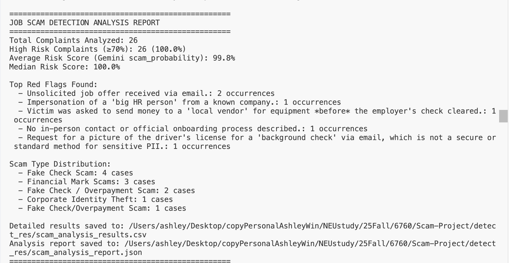

# Job Scam Detection Project - Progress Report

## Report Visualization


---

## What Has Been Completed

### 1. **Data Preparation & Merging**
- Created `data_merge.py` to merge `data-ashley.csv` and `data-jessica.csv`
- Removed duplicates by Complaint ID, extracted essential columns
- Result: 108 unique complaints for job scam

### 2. **System Architecture**
- Modular structure (`scam_detector/` package)
- Separated: detection, API client, prompts, reporting, file handling

### 3. **Prompt Engineering & JSON RAG**
- Job-scam-specific prompt based on research frameworks (Ravenelle et al., 2022; FTC)
- Classification framework in `scam_classification_framework.json`
- **JSON RAG with Caching**: 
  - Framework loaded once at module initialization
  - Framework summary pre-computed and cached for instant access
  - Minimal summary in prompt (~80% token reduction)
  - Uses `@lru_cache` and module-level caching for zero overhead on prompt generation
- Categories: Financial Mark Scams, Scapegoat Scams, Pyramid/MLM, Fake Placement/Staffing, Corporate Identity Theft

### 4. **Performance Optimizations**
- Faster models (`gemini-1.5-flash` prioritized) - 2-3x speedup
- Prompt reduced from ~170 to ~15 lines
- Text truncation (3000 chars)
- **Parallel Workers**: Default 2 workers, configurable via `--workers` flag
  - Usage: `python main.py --input "file.csv" --workers 3`
  - Result: 4-6x faster batch processing

### 5. **Error Handling**
- Improved JSON parsing with fallbacks
- Fixed DataFrame serialization issues
- Enhanced error handling for malformed LLM responses

---

## Current Validation (28 Sample Dataset)

**Dataset**: `data/complaints-2025-11-03-12-03.csv` (28 complaints, ~1-2 job scams)

**Step 1: Create Labels File** (`data/labels.csv`)
| Column | Description | Values |
|--------|-------------|--------|
| `Complaint ID` | From original CSV | e.g., 17186864 |
| `True_Label` | Binary label | `1` = job scam, `0` = not job scam |
| `Category` | Classification | `scam_job`, `scam_other`, `not_scam_irrelevant`, `not_scam_job_relevant` |
| `Notes` | Optional notes | Any text |

**Step 2: Run Detection**
```bash
python main.py --input "data/complaints-2025-11-03-12-03.csv" --workers 2
```

**Step 3: Compare & Analyze**
- Compare `risk_score` (prediction) vs `True_Label` (ground truth)
- Identify false positives/negatives
- Calculate basic accuracy

**Step 4: Prompt Refinement**
- Review error cases, identify patterns
- Update `scam_detector/prompt_scam_analysis.py`
- Re-test if time permits

**Limitations**: Small sample (28), imbalanced (1-2 job scams) - focus on qualitative insights, not statistical significance

---

## Future Work
### Save the result from LLM and use Ml mode like random forest to see if any un-deteced pattern

### 1. **PDF Report Generation** (In Progress)
- Generate PDF reports instead of console output
- Use `reportlab` or `weasyprint`
- Files to create: `scam_detector/pdf_generator.py`
- Files to update: `report_generator.py` (add PDF output support), `main.py` (add `--output-format pdf` option)

### 2. **F1 Analysis** (Future - Larger Dataset)
- Label 200-500 complaints across categories
- Calculate precision, recall, F1 score
- Optimize threshold (test 50, 60, 70, 80, 90)
- Files: `evaluate_model.py`, `scam_detector/metrics.py`

### 3. **Additional Enhancements**
- Chain-of-Thought (CoT) reasoning
- LIME integration for interpretability
- RAG enhancement: vector database from LLM traces (currently using static JSON framework)
- Model comparison (Gemini vs GPT-4 vs Claude)

---

## Notes

- System optimized for speed: 2-3x faster single analysis, 4-6x faster batch processing
- JSON RAG reduces prompt tokens by ~80% while maintaining classification accuracy
- Modular architecture enables easy future enhancements
